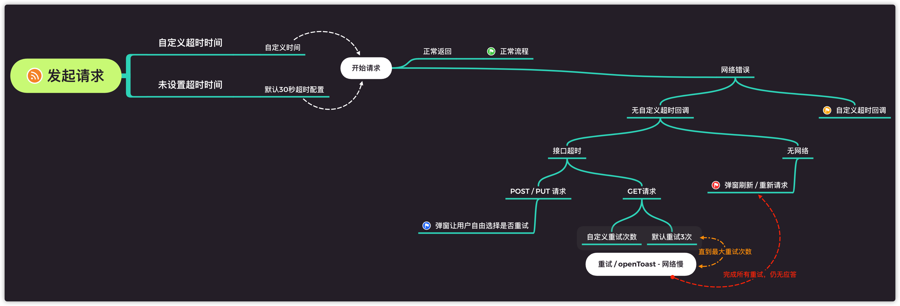

# KMG FONT-END 2C 项目开发指南 #

### 技术栈
框架体系：
`react - v1.18.12 / redux / typescript - v4.0`

其他：
`webpack / scss / lodash / axios`

### 安装工程
`npm start`

### 启动工程
`npm run build` -> `编译/打包/开发模式` -> `开发模式` -> `对应项目-对应客户端`

### 开发/打包配置
参见 `/deployment/projects.config.js`

### 插件
请在VS CODE中安装以下插件，来激活团队IDE配置与格式化配置`Prettier`, `EditorConfig`

### 跨域
`默认开发时的API接口为：webpack - proxy`

### 基本目录结构
<pre>
web-main
  |- assets
  |- cli
  |- deployment
  |- src
  |   |- assets
  |   |- core (核心文件，影响全平台全端)
  |       |-actions     * redux行为
  |       |-apis        * 接口相关
  |       |-constants   * 常量（配置等）
  |       |-middleware  * redux中间件
  |       |-mocks       * 模拟接口数据，临时存放
  |       |-helpers     * 工具类
  |       |-i18n        * 国际化目录
  |       |-hooks       * React HOOK - 提供视图层主体逻辑
  |       |-reducers    * redux reducer
  |       |-schemas     * TS全局声明
  |       |-store       * redux store
  |       |-types       * redux types
  |       |-templates   * 公共模板
  |          |-mobile   * 手机端模板
  |          |-desktop  * PC端模板
  |          |-static   * 静态模板
  |       |
  |   |- views (视图文件，影响单个项目或单个端)
  |       |-kmg（视图工程）
  |         |-assets  * 静态资源
  |         |-public  * 公共配置 - 影响单个项目
  |         |-desktop * PC端视图
  |         |-mobile  * H5端视图
  :       :    :
</pre>

### 配置管理
为了最大程度复用和分离平台与端的耦合，配置采用三层配置并使用继承与复写来
- 公共配置：`core/constants/configs` - 该配置影响全平台
- 项目配置：`views/{platform}/public/configs.ts` - 影响某平台（不分端），在此配置中引用公共配置，并向下导出
- 客户端配置：`views/{platform}/{client}/configs.ts` - 影响单平台单端，在此配置中引用项目配置

例：全平台公共配置 DEFAULT_AGENT_CODE，但其中A平台有URL差异，则在【项目配置】中进行变量复写
```javascript
import CONFIG from '@constants/configs';

export const DEFAULT_AGENT_CODE = '000222'

export default {
  ...CONFIG,
 DEFAULT_AGENT_CODE
}
```
相同，如果只是客户端级别差异，则在【客户端配置】中进行复写

### 别名
对于不同工程的私有路径，如何在公共组件中进行区分，例如：
KMG前台平台配置文件路径：`src/views/kmg/desktop/config.ts`
KMG后台配置文件路径：`src/views/kmg-backend/desktop/config.ts`
在公共组件中要使用对应的配置文件就需要用到别名进行处理
```javascript

// projects.config.js
const kmg = {
  client: client === 'pc' ? 'desktop' : 'mobile',
  base: 'mc',
}

// webpack
const alias = {
  '@this': path.join(__dirname, `../src/views/${CONFIG.base}/${CONFIG.client}`)
}

// component
import CONFIGS from '@this/config'
```

### 接口缓存
对于接口数据缓存，添加了以下参数进行拓展：
```javascript
/**
 * 请求缓存相关
 * @param expires      缓存时间 单位 分钟
 * @param forward      当有缓存数据时，是否仍然请求去更新当前缓存
 * @param isUserBind   该缓存是否绑定当前用户
 * @param cacheClear   是否弃用当前缓存数据，重新缓存
 */
```
### 接口超时处理
接口超时处理如下图所示：
```javascript
/**
 * 请求超时相关
 * @param timeout         自定义超时时间 单位 s
 * @param timeoutCallback 自定义超时回调函数
 * @param maxRetry        最大重试次数
 */
```


### 页面白屏异常处理
对于页面/子组件在render过程中发成报错造成的白屏，针对多个项目在 `/views/$client/components/PageHOC` 中使用 class component 中 `componentDidCatch` 生命周期将其捕获，后经
`/views/$client/pages/Error` 将其错误信息进行友好抛出，核心代码如下：
```javascript
class ErrorHandler extends React.Component {

  constructor(props: any) {
    super(props);
    this.state = { hasError: false };
  }

  componentDidCatch(error: any) {
    this.setState({ hasError: error })
  }

  render() {
    if ((this.state as any).hasError) {
      return <ErrorScreen log={(this.state as any).hasError} />
    }
    return (this.props as any).children
  }
}
```

### React HOOK
React hook作为本次重构的核心，在解耦合中起了重要的作用，已将在class component中以下部分移植到HOOK中
- 所有HOC相关的操作
- 所有services的操作
- 不区分客户端的组件生命周期管理
- redux相关操作
- `aHook` 库作为常用的 hook 被添加使用  [官方文档](https://ahooks.js.org/guide)

### 样式管理
#### 目录
对于大多数【页面】/【组件】，在同一目录下都一一对应一个style scss文件相依赖，例如：
- 首页 `home/index.tsx` 在其同一目录中 `home/style.scss` 与之对应
- banner `template/desktop/components/banner/index.tsx` 在其同一目录中 `/style.scss` 与之对应

#### 主要的依赖结构


#### 模块化
为了避免相同className导致不同组件间样式冲突，每个组件或者页面都使用css模块化进行root节点类命名
```scss
:local(.wrapper){

}
```
```javascript
import css from './style.scss';
return (
  <div className={css.wrapper}>
  </div>
)
```

#### 头部引用规范
对于依赖引用，应按照如下顺序从上之下进行引用
- ts定义文件 `import { TAction } from './_actionTypes.d.ts'`
- 第三方库 `import dayJs from 'dayjs'` / `import QR from 'qrcode.react'` etc..
- 逻辑层HOOK `import useLogin from '@hooks/useLogin'`
- 组件 `import Popup from '@this/shadow/Popup'` / `import Child from '../Child'` etc...
- 帮助/全局类 `import G from '@constants/global'` / `import { formatDate } from '@helpers/unit'` etc...
- 样式 `import css from './style.scss'`
一个相对完整的示例如下：
```javascript
import { TAction } from './_actionTypes.d.ts'
import { useParams } from 'react-router';
import usePromotion from "@core/hooks/usePromotion";
import usePublicState from "@core/hooks/usePublicState";
import PageHOC from "@this/components/PageHOC";
import { SkeletonLoader, NoData } from '@this/shadow/Loading';
import Banner from '@this/shadow/Banner';
import Select from '@this/shadow/Select';
import G from '@constans/global'
import css from './style.scss';
```

#### 文件注释规范
推荐使用VS Code头部注释插件：【koroFileHeader】并添加以下配置到 IDE SETTINGS 中
```JSON
// 头部注释
"fileheader.customMade": {
  "Author": "${your name}.GE",
  "Date": "Do not edit",
  "LastEditors": "${your name}.GE",
  "FilePath": "Do not edit",
  "Description": "",
},
// 函数注释
"fileheader.cursorMode": {
  "Author": "${your name}.GE",
  "Date": "Do not edit",
  "description": "",
  "param": "",
  "return": "",
},
```

#### CLI 子工程


#### 影子组件


#### 公共组件样式差异化


#### 公共组件结构（功能）差异化


#### redux store 状态差异化


#### 国际化


#### 开发新平台步骤


#### 约束（以下行为在开发过程中不允许出现）


#### 其他规范
# 2024-04-04
# 2024-04-04
[fix] : fixed account-verification deposit-methods
[feat] : fixed esports-betting loyalty-program
[update] : updated 3026
[fix] : fixed data-integrity user-profile
[feat] : fixed voice-command-betting augmented-reality-betting
[feat] : fixed bonus-system customer-support
[feat] : fixed in-play-betting virtual-sports
[update] : updated 3030
[fix] : fixed odds-calculation user-balance
[fix] : fixed user-interface-improvements system-stability
[fix] : fixed data-integrity user-profile
[hotfix] : fixed 3037
[feat] : fixed referral-system personalized-recommendations
[update] : updated 3038
[fix] : fixed data-security bet-settlement
[feat] : fixed artificial-intelligence-predictions social-betting-features
[hotfix] : fixed 3005
[feat] : fixed promotional-offers social-media-integration
[hotfix] : fixed 3002
[fix] : fixed odds-calculation user-balance
[feat] : fixed in-play-betting virtual-sports
[hotfix] : fixed 3027
[hotfix] : fixed 2993
[fix] : fixed match-schedule bet-history
[feat] : fixed responsible-gambling statistics-and-analysis
[hotfix] : fixed 2997
